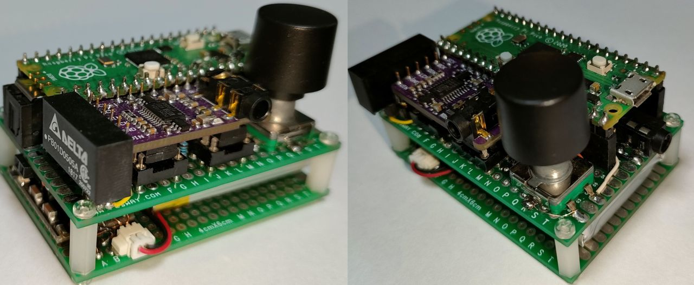

# S/PDIF DAC Headphone Amp for Raspberry Pi Pico / Pico 2


[](https://github.com/elehobica/pico_spdif_dac_hpamp/actions/workflows/build-binaries.yml)

## Overview
* Application of [pico_spdif_rx](https://github.com/elehobica/pico_spdif_rx/) project
* DAC Headphone Amp for SPDIF input
* DAC volume by rotary encoder
* Li-Po battery operation
* Auto power off when no-sync / no-signal timeout

## Supported Board and Peripheral Devices
* Raspberry Pi Pico (rp2040)
* Raspberry Pi Pico 2 (rp2350)
* SPDIF Coaxial or TOSLINK (DLR1160 or equivalent) receiver
* PCM5102 DAC board
* FM5324, MH-CD42 or IP5306 Li-Po Charger board

## Pin Assignment
### PCM5102
| Pico Pin # | GPIO | Function | Connection |
----|----|----|----
| 21 | GP16 | BCK | to PCM5102 BCK (13) |
| 22 | GP17 | LRCK | to PCM5102 LRCK (15) |
| 23 | GND | GND | GND |
| 24 | GP18 | SDO | to PCM5102 DIN (14) |

### Rotary Encoder
| Pico Pin # | Pin Name | Function | Connection |
----|----|----|----
| 31 | GP26 | GPIO Input | A Pin |
| 32 | GP27 | GPIO Input | B Pin |
| 33 | GND | GND | GND |

### Power Control
| Pico Pin # | Pin Name | Function | Connection |
----|----|----|----
| 29 | GP22 | GPIO Output | CHARGER_KEY_EN |
| 34 | GP28 | GPIO Output | P5V_EN |

## Schematic
[pico_spdif_dac_hpamp.pdf](doc/pico_spdif_dac_hpamp.pdf)

## How to build
* See ["Getting started with Raspberry Pi Pico"](https://datasheets.raspberrypi.org/pico/getting-started-with-pico.pdf)
* Put "pico-sdk", "pico-examples" and "pico-extras" on the same level with this project folder.
* Set environmental variables for PICO_SDK_PATH, PICO_EXTRAS_PATH and PICO_EXAMPLES_PATH
* Confirmed with Pico SDK 2.1.1
```
> git clone -b 2.1.1 https://github.com/raspberrypi/pico-sdk.git
> cd pico-sdk
> git submodule update -i
> cd ..
> git clone -b sdk-2.1.1 https://github.com/raspberrypi/pico-examples.git
>
> git clone -b sdk-2.1.1 https://github.com/raspberrypi/pico-extras.git
> 
> git clone -b main https://github.com/elehobica/pico_spdif_dac_hpamp.git
> cd pico_spdif_dac_hpamp
> git submodule update -i
> cd ..
```
### Windows
* Build is confirmed with Developer Command Prompt for VS 2022 and Visual Studio Code on Windows environment
* Confirmed with cmake-3.27.2-windows-x86_64 and gcc-arm-none-eabi-10.3-2021.10-win32
* Lanuch "Developer Command Prompt for VS 2022"
```
> cd pico_spdif_dac_hpamp
> mkdir build && cd build
> cmake -G "NMake Makefiles" ..  ; (for Raspberry Pi Pico 1 series)
> cmake -G "NMake Makefiles" -DPICO_PLATFORM=rp2350 -DPICO_BOARD=pico2 ..  ; (for Raspberry Pi Pico 2)
> nmake
```
* Put "*.uf2" on RPI-RP2 or RP2350 drive
### Linux
* Build is confirmed with [pico-sdk-dev-docker:sdk-2.1.1-1.0.0]( https://hub.docker.com/r/elehobica/pico-sdk-dev-docker)
* Confirmed with cmake-3.22.1 and arm-none-eabi-gcc (15:10.3-2021.07-4) 10.3.1
```
$ cd pico_spdif_dac_hpamp
$ mkdir build && cd build
$ cmake ..  # (for Raspberry Pi Pico 1 series)
$ cmake -DPICO_PLATFORM=rp2350 -DPICO_BOARD=pico2 ..  # (for Raspberry Pi Pico 2)
$ make -j4
```
* Download "*.uf2" on RPI-RP2 or RP2350 drive