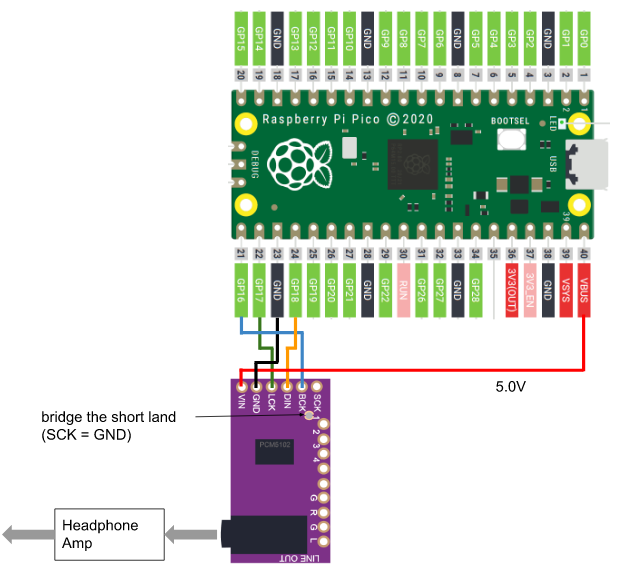

# Raspberry Pi Pico spdif_rx DAC HPAmp

## Supported Board and Peripheral Devices
* Raspberry Pi Pico (rp2040)
* SPDIF Coaxial or TOSLINK (RX178A or equivalent) receiver
* PCM5102

## Pin Assignment
### PCM5102
| Pico Pin # | GPIO | Function | Connection |
----|----|----|----
| 21 | GP16 | BCK | to PCM5102 BCK (13) |
| 22 | GP17 | LRCK | to PCM5102 LRCK (15) |
| 23 | GND | GND | GND |
| 24 | GP18 | SDO | to PCM5102 DIN (14) |
| 40 | VBUS | VCC | to VIN of PCM5102 board |

### Rotary Encoder
| Pico Pin # | Pin Name | Function | Connection |
----|----|----|----
| 31 | GP26 | GPIO Input | A Pin |
| 32 | GP27 | GPIO Input | B Pin |
| 33 | GND | GND | GND |

