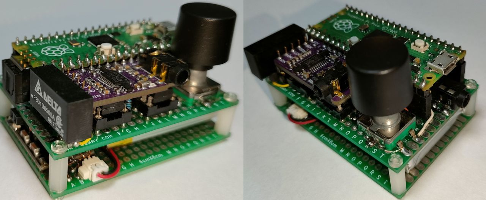

# S/PDIF DAC headphone amp for Raspberry Pi Pico


## Overview
* Application of [pico_spdif_rx](https://github.com/elehobica/pico_spdif_rx/) project
* DAC Headphone Amp for SPDIF input
* DAC volume by rotary encoder
* Li-Po battery opration
* Auto power off by no-sync / no-single timeout

## Supported Board and Peripheral Devices
* Raspberry Pi Pico (rp2040)
* SPDIF Coaxial or TOSLINK (DLR1160 or equivalent) receiver
* PCM5102 DAC board
* FM5324 Li-Po Charger board

## Pin Assignment
### PCM5102
| Pico Pin # | GPIO | Function | Connection |
----|----|----|----
| 21 | GP16 | BCK | to PCM5102 BCK (13) |
| 22 | GP17 | LRCK | to PCM5102 LRCK (15) |
| 23 | GND | GND | GND |
| 24 | GP18 | SDO | to PCM5102 DIN (14) |
| 40 | VBUS | VCC | to VIN of PCM5102 board |

### Rotary Encoder
| Pico Pin # | Pin Name | Function | Connection |
----|----|----|----
| 31 | GP26 | GPIO Input | A Pin |
| 32 | GP27 | GPIO Input | B Pin |
| 33 | GND | GND | GND |

### Power Control for DAC & AMP 
| Pico Pin # | Pin Name | Function | Connection |
----|----|----|----
| 34 | GP28 | GPIO Output | P5V_EN |

## Schematic
[pico_spdif_dac_hpamp.pdf](doc/pico_spdif_dac_hpamp.pdf)

## How to build
* See ["Getting started with Raspberry Pi Pico"](https://datasheets.raspberrypi.org/pico/getting-started-with-pico.pdf)
* Build is confirmed only in Developer Command Prompt for VS 2019 and Visual Studio Code on Windows enviroment
* Put "pico-sdk", "pico-examples" (, "pico-extras" and "pico-playground") on the same level with this project folder.
* Confirmed under Pico SDK 1.4.0
```
> git clone -b master https://github.com/raspberrypi/pico-sdk.git
> cd pico-sdk
> git submodule update -i
> cd ..
> git clone -b master https://github.com/raspberrypi/pico-examples.git
>
> git clone https://github.com/raspberrypi/pico-extras.git
> cd pico-extras
> git submodule update -i
> cd ..
> 
> git clone -b main https://github.com/elehobica/pico_spdif_dac_hpamp
```
* Lanuch "Developer Command Prompt for VS 2019"
```
> cd pico_spdif_dac_hpamp
> git submodule update -i
> mkdir build
> cd build
> cmake -G "NMake Makefiles" ..
> nmake
```
* Put "pico_spdif_dac_hpamp.uf2" on RPI-RP2 drive